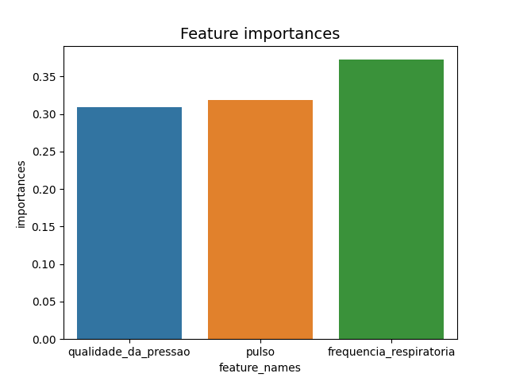
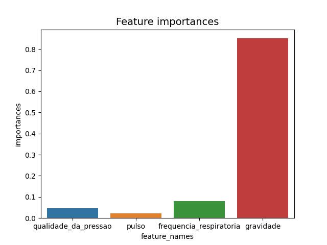
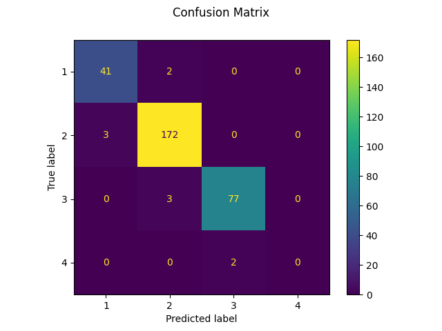

# Algoritmo Regressor e Classificador utilizando Árvores, Florestas e Redes Neurais para a resolução de um problema de decisão de resgate de indivíduos em diferentes estados de estabilidade.

## Executar
1. Tenha `python3` e `pip3` instalado.
2. `pip3 install -r requirements.txt`
3. `python3 main.py`

## Resultados Obtidos

### Gráfico de importância de feature - Tree Regressor

### Gráfico de importância de feature - Tree Classifier

### Gráfico de importância de feature - Forest Regressor

### Gráfico de importância de feature - Forest Classifier

### Matriz de confusão - Tree Classifier

### Matriz de confusão - Forest Classifier

### Matriz de confusão - Neural Classifier

### Curva de perda - Neural Regressor

### Curva de perda - Neural Classifier

